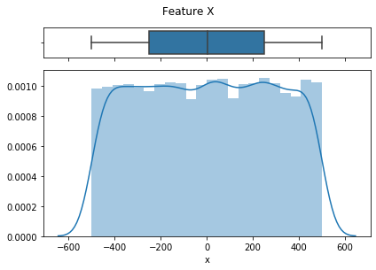
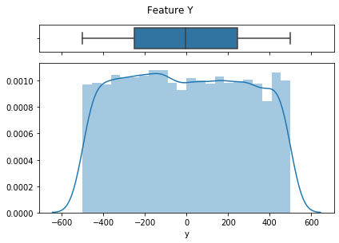
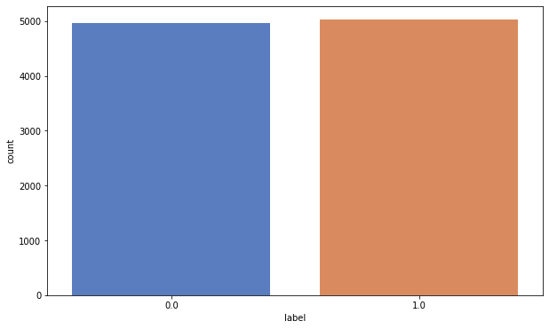
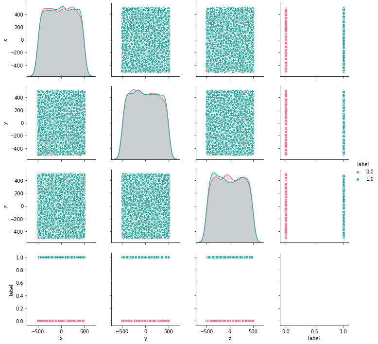
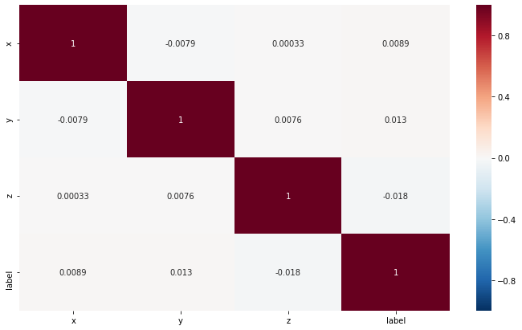

**Name**: Matheus Jericó Palhares<br>
**E-mail**: matheusjerico1994@hotmail.com<br>
**LinkedIn**: https://www.linkedin.com/in/matheusjerico<br>

### Data Science Small Test

### 1. Loading libraries


```python
import pandas as pd
import numpy as np
import seaborn as sns
import matplotlib.pyplot as plt
from scipy.stats import skew, kurtosis
from sklearn.metrics import classification_report, roc_auc_score, confusion_matrix, accuracy_score
from sklearn.model_selection import train_test_split, KFold, cross_val_score, GridSearchCV
from sklearn.preprocessing import StandardScaler
from sklearn.tree import DecisionTreeClassifier
from sklearn.naive_bayes import GaussianNB
from sklearn.linear_model import LogisticRegression
from sklearn.svm import SVC
from sklearn.ensemble import GradientBoostingClassifier, RandomForestClassifier, AdaBoostClassifier
from xgboost import XGBClassifier

import warnings
warnings.filterwarnings('ignore')
```


```python

```

### 2. Loading Dataset


```python
dataset = pd.read_csv("df_points.txt", sep = "\t", index_col=[0])
```


```python
dataset.head()
```


<div>
<style scoped>
    .dataframe tbody tr th:only-of-type {
        vertical-align: middle;
    }

    .dataframe tbody tr th {
        vertical-align: top;
    }

    .dataframe thead th {
        text-align: right;
    }
</style>
<table border="1" class="dataframe">
  <thead>
    <tr style="text-align: right;">
      <th></th>
      <th>x</th>
      <th>y</th>
      <th>z</th>
      <th>label</th>
    </tr>
  </thead>
  <tbody>
    <tr>
      <td>0</td>
      <td>326.488285</td>
      <td>188.988808</td>
      <td>-312.205307</td>
      <td>0.0</td>
    </tr>
    <tr>
      <td>1</td>
      <td>-314.287214</td>
      <td>307.276723</td>
      <td>-179.037412</td>
      <td>1.0</td>
    </tr>
    <tr>
      <td>2</td>
      <td>-328.208910</td>
      <td>181.627758</td>
      <td>446.311062</td>
      <td>1.0</td>
    </tr>
    <tr>
      <td>3</td>
      <td>-148.658890</td>
      <td>147.027947</td>
      <td>-27.477959</td>
      <td>1.0</td>
    </tr>
    <tr>
      <td>4</td>
      <td>-467.065931</td>
      <td>250.467651</td>
      <td>-306.475330</td>
      <td>1.0</td>
    </tr>
  </tbody>
</table>
</div>


```python
dataset.info()
```

    <class 'pandas.core.frame.DataFrame'>
    Int64Index: 10000 entries, 0 to 9999
    Data columns (total 4 columns):
    x        10000 non-null float64
    y        10000 non-null float64
    z        10000 non-null float64
    label    10000 non-null float64
    dtypes: float64(4)
    memory usage: 390.6 KB


- No **NaN** features, all features is foat64.


```python
dataset.describe()
```


<div>
<style scoped>
    .dataframe tbody tr th:only-of-type {
        vertical-align: middle;
    }

    .dataframe tbody tr th {
        vertical-align: top;
    }

    .dataframe thead th {
        text-align: right;
    }
</style>
<table border="1" class="dataframe">
  <thead>
    <tr style="text-align: right;">
      <th></th>
      <th>x</th>
      <th>y</th>
      <th>z</th>
      <th>label</th>
    </tr>
  </thead>
  <tbody>
    <tr>
      <td>count</td>
      <td>10000.000000</td>
      <td>10000.000000</td>
      <td>10000.000000</td>
      <td>10000.000000</td>
    </tr>
    <tr>
      <td>mean</td>
      <td>0.850362</td>
      <td>-3.108769</td>
      <td>-2.601124</td>
      <td>0.502700</td>
    </tr>
    <tr>
      <td>std</td>
      <td>288.379928</td>
      <td>287.120263</td>
      <td>290.379789</td>
      <td>0.500018</td>
    </tr>
    <tr>
      <td>min</td>
      <td>-499.802348</td>
      <td>-499.899134</td>
      <td>-499.952571</td>
      <td>0.000000</td>
    </tr>
    <tr>
      <td>25%</td>
      <td>-249.199895</td>
      <td>-248.954580</td>
      <td>-258.005693</td>
      <td>0.000000</td>
    </tr>
    <tr>
      <td>50%</td>
      <td>3.663472</td>
      <td>-5.446168</td>
      <td>-8.221000</td>
      <td>1.000000</td>
    </tr>
    <tr>
      <td>75%</td>
      <td>248.879970</td>
      <td>244.395864</td>
      <td>252.930406</td>
      <td>1.000000</td>
    </tr>
    <tr>
      <td>max</td>
      <td>499.872453</td>
      <td>499.752418</td>
      <td>499.872329</td>
      <td>1.000000</td>
    </tr>
  </tbody>
</table>
</div>


- Feature's values oscillate between 500 a -500.

### 3. Visualizing data

#### 3.1 Data Distribution and BoxPlot

#### 3.1.1 Feature X


```python
# Construindo duas janelas
f, (ax_box, ax_hist) = plt.subplots(2, sharex=True, gridspec_kw={"height_ratios": (.15, .85)})

# Adicionando boxplot e histograma
sns.boxplot(dataset["x"], ax=ax_box)
sns.distplot(dataset["x"], ax=ax_hist)

# Removendo nome do boxplot
ax_box.set(xlabel='')

# Adicionando titulo
f.tight_layout()
f.suptitle("Feature X", y = 1.05)
```


    Text(0.5, 1.05, 'Feature X')





```python
print("Skewness: {}".format(skew(dataset['x'])))
print("Kurtosis: {}".format(kurtosis(dataset['x'])))
```

    Skewness: -0.003793487075166629
    Kurtosis: -1.1984099667309176


#### 3.1.2. Feature Y


```python
# Construindo duas janelas
f, (ax_box, ax_hist) = plt.subplots(2, sharex=True, gridspec_kw={"height_ratios": (.15, .85)})

# Adicionando boxplot e histograma
sns.boxplot(dataset["y"], ax=ax_box)
sns.distplot(dataset["y"], ax=ax_hist)

# Removendo nome do boxplot
ax_box.set(xlabel='')

# Adicionando titulo
f.tight_layout()
f.suptitle("Feature Y", y = 1.05)
```


    Text(0.5, 1.05, 'Feature Y')





```python
print("Skewness: {}".format(skew(dataset['y'])))
print("Kurtosis: {}".format(kurtosis(dataset['y'])))
```

    Skewness: 0.02891016663874011
    Kurtosis: -1.1902434753600712


#### 3.1.3. Feature Z


```python
print("Skewness: {}".format(skew(dataset['z'])))
print("Kurtosis: {}".format(kurtosis(dataset['z'])))
```

    Skewness: 0.020935683143894546
    Kurtosis: -1.2158864778879535


**Analysis:**
    - Features variables hava normal distribution.

#### 3.1.4 Target Label


```python
plt.figure(figsize=(10, 6))
sns.countplot(dataset["label"], palette="muted")
dataset["label"].value_counts()
```


    1.0    5027
    0.0    4973
    Name: label, dtype: int64





**Analysis:**
    - Target variable has balanced distribution.

#### 3.1.5 Features x Label


```python
g = sns.pairplot(dataset, hue="label", palette="husl")
```





### 4. Correlation


```python
plt.figure(figsize=(12, 7))
heat_map = sns.heatmap(dataset.corr(),annot=True, linewidths=0, vmin=-1, cmap="RdBu_r")
plt.show(heat_map)
```





### 5. Segregate a X and y variables


```python
y = dataset['label']
X = dataset.drop(columns= ['label'])
```

### 6. Voting Classifier
- Selecting machine learning models


```python
# Definindo os valores para o número de folds
num_folds = 10
seed = 7

# Separando os dados em folds
kfold = KFold(num_folds, True, random_state = seed)

modelos = []
modelos.append(("Logistic Regression", LogisticRegression()))
modelos.append(('Naive Bayes', GaussianNB()))
modelos.append(("Gradient Boosting Classifier", GradientBoostingClassifier()))
modelos.append(("Decision Tree", DecisionTreeClassifier()))
modelos.append(("Random Forest", RandomForestClassifier()))
modelos.append(("XGB Classifier", XGBClassifier()))
modelos.append(("AdaBoostClassifier", AdaBoostClassifier()))
modelos.append(('SVC', SVC()))

# Avaliando cada modelo em um loop
resultados = []
nomes = []

for nome, modelo in modelos:
    kfold = KFold(n_splits = num_folds, random_state = seed)
    cv_results = cross_val_score(modelo, X, y, cv = kfold, scoring = 'accuracy')
    resultados.append(cv_results)
    nomes.append(nome)
    msg = "%s: %f (%f)" % (nome, cv_results.mean(), cv_results.std())
    print(msg)
```

    Logistic Regression: 0.552200 (0.009786)
    Naive Bayes: 0.550000 (0.017635)
    Gradient Boosting Classifier: 0.580100 (0.053279)
    Decision Tree: 0.667100 (0.018609)
    Random Forest: 0.777900 (0.011819)
    XGB Classifier: 0.582300 (0.040578)
    AdaBoostClassifier: 0.505200 (0.018819)
    SVC: 0.752400 (0.011586)


**Analysis:**
- The best models for this problem are:
        - Random Forest;
        - SVM.
Selecting **Random Forest**, **SVM** and **Gradient Boosting**, because after tunning with GridSearch, the model Gradient Boost will have good performace.

### 7. Data Manipulation

#### 7.1. Standardize features by removing the mean and scaling to unit variance


```python
scaler = StandardScaler()
X_scaler = scaler.fit_transform(X)
```

#### 7.2. Segregate a test and training frame
- Split arrays or matrices into random train and test subsets


```python
X_train, X_test, y_train, y_test = train_test_split(X_scaler, y, test_size=0.20)
```

### 8. Grid Search CV
- GridSearchCV implements a “fit” and a “score” method. It also implements “predict”, “predict_proba”, “decision_function”, “transform” and “inverse_transform” if they are implemented in the estimator used.

#### 8.1. C-Support Vector Classification


```python
# Construindo duas janelas
f, (ax_box, ax_hist) = plt.subplots(2, sharex=True, gridspec_kw={"height_ratios": (.15, .85)})

# Adicionando boxplot e histograma
sns.boxplot(dataset["z"], ax=ax_box)
sns.distplot(dataset["z"], ax=ax_hist)

# Removendo nome do boxplot
ax_box.set(xlabel='')

# Adicionando titulo
f.tight_layout()
f.suptitle("Feature Z", y = 1.05)
```


    Text(0.5, 1.05, 'Feature Z')


```python
# SVC params
grid_svc = {'C':[0.01, 0.1, 1, 10, 100],
            'gamma':['scale', 'auto'],
            'kernel': ['linear', 'poly', 'rbf', 'sigmoid']}
# Creating model
svc = SVC()
# Apply GridSearchCV
clf_svc = GridSearchCV(svc, param_grid = grid_svc, cv = 5,  scoring = 'accuracy', n_jobs = -1)
# Train model
clf_svc.fit(X_train, y_train)
# Make preditction
y_pred_svc = clf_svc.predict(X_test)
```


```python
# Evaluate model SVC
print("Precision, Recall and f1-score:\n{}".format(classification_report(y_test, y_pred_svc)))
print("-----------------------------------------------------------------------------------")
print("Confusion Matrix: \n{}".format(confusion_matrix(y_test, y_pred_svc)))
print("-----------------------------------------------------------------------------------")
print("Roc AUC: {}".format(roc_auc_score(y_test, y_pred_svc)))
print("-----------------------------------------------------------------------------------")
print("Accuracy: {}".format(accuracy_score(y_test, y_pred_svc)))
```

    Precision, Recall and f1-score:
                  precision    recall  f1-score   support
    
             0.0       0.78      0.76      0.77      1010
             1.0       0.76      0.78      0.77       990
    
        accuracy                           0.77      2000
       macro avg       0.77      0.77      0.77      2000
    weighted avg       0.77      0.77      0.77      2000
    
    -----------------------------------------------------------------------------------
    Confusion Matrix: 
    [[767 243]
     [217 773]]
    -----------------------------------------------------------------------------------
    Roc AUC: 0.7701070107010701
    -----------------------------------------------------------------------------------
    Accuracy: 0.77


#### 8.2. Random Forest Classifier


```python
# Random Forest params
grid_rf = {
    "n_estimators":[10, 100, 200, 500],
    "max_depth": [3, 5, 8, 15, 20],
    "criterion": ["gini", "entropy"],
    "max_features": ['auto', 'sqrt', 'log2']
    }

# Create model
rf = RandomForestClassifier()
# Apply GridSearchCV
clf_rf = GridSearchCV(rf, param_grid = grid_rf, cv=3, scoring = 'accuracy', n_jobs = -1)
# Train model
clf_rf.fit(X_train, y_train)
# Make prediction
y_pred_rf = clf_rf.predict(X_test)
```


```python
# Evaluate model Random Forest
print("Precision, Recall and f1-score:\n{}".format(classification_report(y_test, y_pred_rf)))
print("-----------------------------------------------------------------------------------")
print("Confusion Matrix: \n{}".format(confusion_matrix(y_test, y_pred_rf)))
print("-----------------------------------------------------------------------------------")
print("Roc AUC: {}".format(roc_auc_score(y_test, y_pred_rf)))
print("-----------------------------------------------------------------------------------")
print("Accuracy: {}".format(accuracy_score(y_test, y_pred_rf)))
```

    Precision, Recall and f1-score:
                  precision    recall  f1-score   support
    
             0.0       0.79      0.81      0.80      1010
             1.0       0.80      0.78      0.79       990
    
        accuracy                           0.80      2000
       macro avg       0.80      0.80      0.80      2000
    weighted avg       0.80      0.80      0.80      2000
    
    -----------------------------------------------------------------------------------
    Confusion Matrix: 
    [[817 193]
     [216 774]]
    -----------------------------------------------------------------------------------
    Roc AUC: 0.7953645364536454
    -----------------------------------------------------------------------------------
    Accuracy: 0.7955


#### 8.3. Gradient Boosting Classifier


```python
# GradientBoostingClassifier params
grid_gbc = {
    "loss":["deviance", "exponential"],
    "learning_rate": [0.001, 0.01, 0.1, 1],
    "max_depth":[3, 5, 8, 15, 20],
    "subsample":[0.5, 1.0],
    "max_features":["auto","sqrt","log2"],
    "n_estimators":[10, 100, 200, 500]
    }
# Create model
GBC = GradientBoostingClassifier()
# Apply GridSearchCV
clf_gbc = GridSearchCV(GBC, param_grid = grid_gbc, cv=3, scoring = 'accuracy', verbose=0, n_jobs=-1)
# Train model
clf_gbc.fit(X_train, y_train)
# Make predictions
y_pred_gbc = clf_gbc.predict(X_test)

```


```python
# Evaluate model Gradient Boosting
print("Precision, Recall and f1-score:\n{}".format(classification_report(y_test, y_pred_gbc)))
print("-----------------------------------------------------------------------------------")
print("Confusion Matrix: \n{}".format(confusion_matrix(y_test, y_pred_gbc)))
print("-----------------------------------------------------------------------------------")
print("Roc AUC: {}".format(roc_auc_score(y_test, y_pred_gbc)))
print("-----------------------------------------------------------------------------------")
print("Accuracy: {}".format(accuracy_score(y_test, y_pred_gbc)))
```

    Precision, Recall and f1-score:
                  precision    recall  f1-score   support
    
             0.0       0.80      0.81      0.81      1010
             1.0       0.81      0.79      0.80       990
    
        accuracy                           0.80      2000
       macro avg       0.80      0.80      0.80      2000
    weighted avg       0.80      0.80      0.80      2000
    
    -----------------------------------------------------------------------------------
    Confusion Matrix: 
    [[821 189]
     [203 787]]
    -----------------------------------------------------------------------------------
    Roc AUC: 0.803910391039104
    -----------------------------------------------------------------------------------
    Accuracy: 0.804


#### 8.4. Logistic Regression


```python
# SVC params
grid_lr = {'C':[0.01, 0.1, 1, 10, 100],
            'penalty':['l1','l2','elasticnet'],
            'solver':['newton-cg', 'lbfgs', 'liblinear', 'sag', 'saga']}

# Creating model
logisticRegression = LogisticRegression()
# Apply GridSearchCV
clf_lr = GridSearchCV(logisticRegression, param_grid = grid_lr, cv = 5,  scoring = 'accuracy', n_jobs = -1)
# Train model
clf_lr.fit(X_train, y_train)
# Make preditction
y_pred_lr = clf_lr.predict(X_test)
```


```python
# Evaluate model Gradient Boosting
print("Precision, Recall and f1-score:\n{}".format(classification_report(y_test, y_pred_lr)))
print("-----------------------------------------------------------------------------------")
print("Confusion Matrix: \n{}".format(confusion_matrix(y_test, y_pred_lr)))
print("-----------------------------------------------------------------------------------")
print("Roc AUC: {}".format(roc_auc_score(y_test, y_pred_lr)))
print("-----------------------------------------------------------------------------------")
print("Accuracy: {}".format(accuracy_score(y_test, y_pred_lr)))
```

    Precision, Recall and f1-score:
                  precision    recall  f1-score   support
    
             0.0       0.58      0.43      0.49      1010
             1.0       0.54      0.68      0.60       990
    
        accuracy                           0.55      2000
       macro avg       0.56      0.56      0.55      2000
    weighted avg       0.56      0.55      0.55      2000
    
    -----------------------------------------------------------------------------------
    Confusion Matrix: 
    [[432 578]
     [314 676]]
    -----------------------------------------------------------------------------------
    Roc AUC: 0.5552755275527552
    -----------------------------------------------------------------------------------
    Accuracy: 0.554


#### 9. Result

- After applying method GridSearchCV to tunning hyperparameters on Support Vector Classification, Gradient Boosting Classifier, Random Forest Classifier and Logistic Regression models, the **Gradient Boosting Classifier** model was evaluated with the best accuracy, presicion, recall and roc_auc metrics. The ensemble models performed much better than the logistic regression.

#### Metrics abaout Gradient Boosting Classifier:


```python
# Evaluate model Gradient Boosting
print("Precision, Recall and f1-score:\n{}".format(classification_report(y_test, y_pred_gbc)))
print("-----------------------------------------------------------------------------------")
print("Confusion Matrix: \n{}".format(confusion_matrix(y_test, y_pred_gbc)))
print("-----------------------------------------------------------------------------------")
print("Roc AUC: {}".format(roc_auc_score(y_test, y_pred_gbc)))
print("-----------------------------------------------------------------------------------")
print("Accuracy: {}".format(accuracy_score(y_test, y_pred_gbc)))
```

    Precision, Recall and f1-score:
                  precision    recall  f1-score   support
    
             0.0       0.80      0.81      0.81      1010
             1.0       0.81      0.79      0.80       990
    
        accuracy                           0.80      2000
       macro avg       0.80      0.80      0.80      2000
    weighted avg       0.80      0.80      0.80      2000
    
    -----------------------------------------------------------------------------------
    Confusion Matrix: 
    [[821 189]
     [203 787]]
    -----------------------------------------------------------------------------------
    Roc AUC: 0.803910391039104
    -----------------------------------------------------------------------------------
    Accuracy: 0.804

